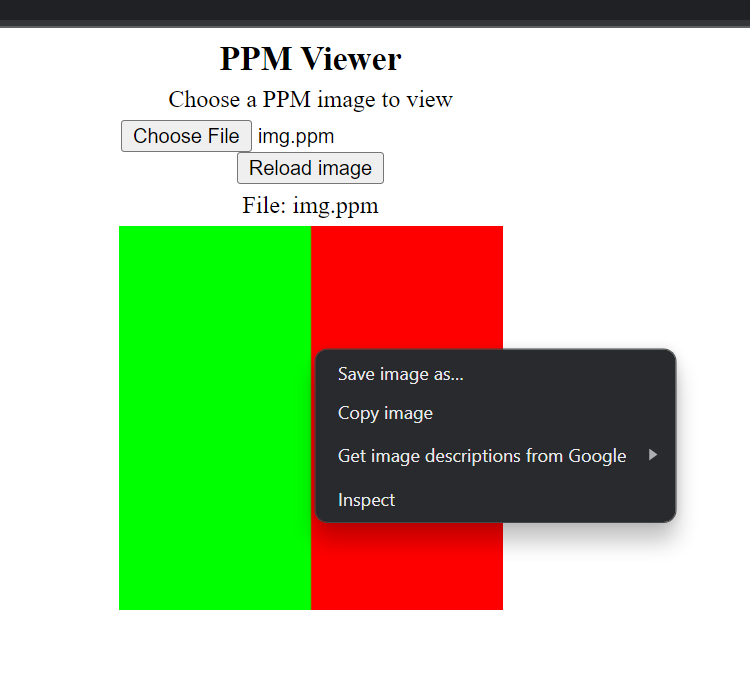

# Assignment-2

In the previous session, we learnt image generation/manipulation through pixel values. This assignment aims to encourage creativity and hands-on experience in generating patterns in images using C++. 

Modify the `image.cpp` file in `files` folder and generate the images/patterns as your liking (e.g. checkerboard, spirals, circles, some drawing? or a :) cat) in `.ppm` format and `.png` and commit your images as your submission.

(Right click on image after opening ppm viewer and save as follows)

## Bonus

All the time we have been generating the image from scratch, now, it's time for some editing! Try to find out how to take input as a file in C++, and try manipulating the sample file `sample.ppm`. For e. g. Make a circle around the face of *lynx* (?) in the image.

(Hints: search for `file handling`, then get the `width` and `height` of image, and as usual iterate over the pixels to manipulate it further)

.

###### (not mandatory)